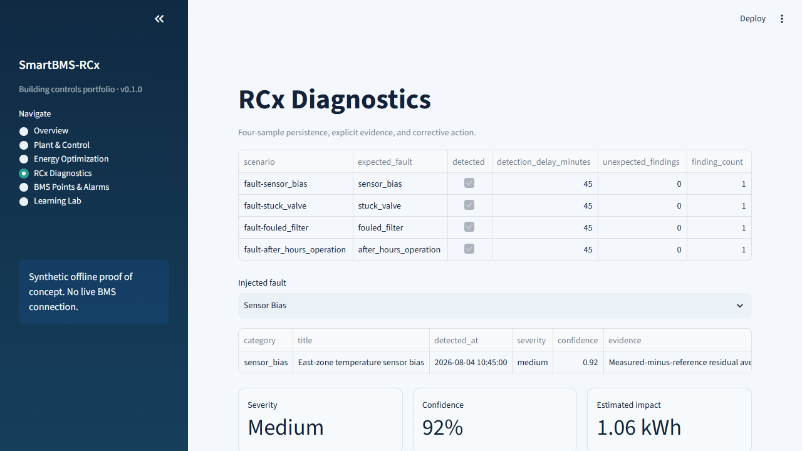
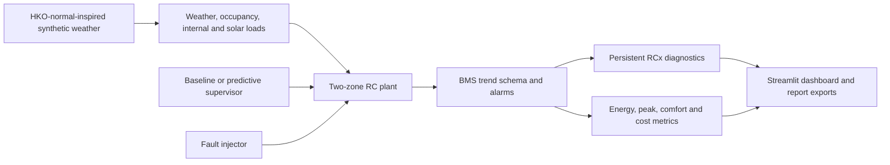

# SmartBMS-RCx

An explainable, offline proof of concept for building HVAC controls, energy optimization, BMS point semantics, and retro-commissioning (RCx) diagnostics.

> **Data and claim boundary:** all weather, occupancy, load, BMS, fault, cost, and savings values in this repository are synthetic. The project is not connected to a real building, does not implement a live BACnet/Modbus client, and does not guarantee real-world savings.

[中文说明](README.zh-CN.md)



## Verified synthetic result

The default run is deterministic: a two-zone Hong Kong office, seven days, 15-minute intervals, and seed `20260803`.

| Metric | Baseline | Predictive supervisor | Change |
|---|---:|---:|---:|
| HVAC energy | 844.288 kWh | 796.814 kWh | 5.623% lower |
| Peak demand | 18.646 kW | 18.507 kW | 0.745% lower |
| Occupied comfort inside 22–26 °C | 86.889% | 100.000% | +13.111 pp |
| Occupied discomfort | 6.253 °C·h | 0.000 °C·h | 6.253 °C·h lower |
| HVAC runtime above 0.5 kW | 83.50 h | 69.25 h | 14.25 h lower |
| Illustrative weekly cost | HK$1,922.92 | HK$1,852.99 | 3.637% lower |

The four injected fault scenarios—temperature-sensor bias, stuck valve, fouled filter, and after-hours operation—are all detected after four persistent samples: **4/4 recall, 45-minute detection delay, and zero unexpected diagnostic findings** in the fixed synthetic test suite.

These values are automatically calculated from interval trends and tested in `tests/test_scenarios.py`; they are not hard-coded dashboard claims.

## What the project demonstrates

- A two-zone first-order resistance-capacitance (RC) thermal model with internal and orientation-dependent solar gains.
- A schedule/proportional baseline and an explainable bounded one-hour candidate search with safe fallback.
- Simplified chiller COP and cubic fan-power behavior with explicit engineering units.
- Four deterministic fault modes and persistent RCx rules with evidence, severity, impact estimate, and corrective action.
- A 19-point simulated BMS registry with BACnet object and Modbus register metadata, plus alarm semantics.
- Six bilingual Streamlit pages: overview, plant/control, optimization, RCx, points/alarms, and a guided Learning Lab. The app defaults to Chinese and switches to English from the sidebar.
- Reproducible Chinese/English HTML and Markdown downloads plus canonical CSV exports, all driven by the same domain APIs as the tests and dashboard.

## Quick start

Python 3.11 or later is recommended.

### Windows PowerShell

```powershell
python -m venv .venv
.\.venv\Scripts\python.exe -m pip install -r requirements.txt
.\.venv\Scripts\python.exe -m unittest discover -s tests -v
.\.venv\Scripts\python.exe -m streamlit run app.py
```

Open `http://localhost:8501` if the browser does not open automatically.

The dashboard opens in Chinese. Use `语言 / Language` at the top of the sidebar to switch the entire interface to English. HTML and Markdown downloads follow the active language and use `-zh` or `-en` in their filenames; raw CSV field names stay in English as stable engineering interfaces.

Generate the technical report and all CSVs:

```powershell
.\.venv\Scripts\python.exe scripts\generate_portfolio.py --output generated
```

### macOS/Linux

```bash
python3 -m venv .venv
.venv/bin/python -m pip install -r requirements.txt
.venv/bin/python -m unittest discover -s tests -v
.venv/bin/python -m streamlit run app.py
```

## Architecture



The domain package is independent of Streamlit. `app.py` is intentionally thin and only renders values from `smartbms` APIs.

## Repository map

```text
smartbms/
  config.py         validated engineering configuration
  weather.py        deterministic Hong Kong summer inputs
  plant.py          two-zone RC and HVAC power model
  controllers.py    baseline and predictive supervisors
  faults.py         four disclosed fault injections
  points.py         simulated BMS registry and alarms
  diagnostics.py    persistent RCx findings
  metrics.py        auditable KPI calculations
  scenarios.py      end-to-end scenario orchestration
  i18n.py           Chinese/English UI and engineering-display localization
  reporting.py      HTML, Markdown, CSV, and manifest exports
app.py               six-page Streamlit interface
tests/               68 unit/integration/smoke tests
docs/                design, architecture, learning, résumé, and interview assets
scripts/             one-command portfolio export
```

## Evidence and reproducibility

Run these before quoting any result:

```powershell
.\.venv\Scripts\python.exe -m unittest discover -s tests -v
.\.venv\Scripts\python.exe scripts\generate_portfolio.py --output generated
```

Inspect:

- `generated/scenario-comparison.csv` for KPI arithmetic;
- `generated/diagnostic-scorecard.csv` for recall and delay;
- `generated/diagnostic-findings.csv` for evidence and recommendations;
- `generated/trends-*.csv` for interval-level recomputation;
- `generated/manifest.json` for the synthetic-data classification.

## Model and claim limitations

- The RC model is educational and not calibrated against a real building envelope.
- The predictive strategy is a bounded candidate search, not a trained AI model and not a full constrained MPC solver.
- The sensor-bias rule uses a simulation reference temperature. A real project would require a calibrated model, redundant sensor, or portable reference instrument.
- Fault impact values are scenario estimates, not measurement-and-verification savings.
- BACnet/Modbus fields show point-model literacy only; network discovery, device security, write interlocks, and commissioning are outside this version.
- The illustrative tariff is not a current utility quotation.

See [architecture.md](docs/architecture.md) for equations and assumptions, [learning-plan.md](docs/learning-plan.md) for the three-week ownership path, and [resume-bullets.md](docs/resume-bullets.md) before putting the project on a résumé.

## Source anchors

- [Hong Kong Observatory 1991–2020 August normals](https://www.hko.gov.hk/en/cis/normal/1991_2020/dnormal08.htm), used only to anchor the synthetic summer profile.
- [EMSD Technical Guidelines on Retro-commissioning](https://www.emsd.gov.hk/filemanager/en/content_718/Technical_Guidelines_Retro-commissioning.pdf), used for RCx workflow context.

No source provides the simulated savings result; that result is produced by this repository's disclosed model and test scenario.
