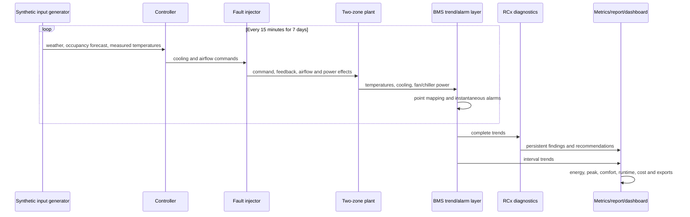

# SmartBMS-RCx Architecture and Engineering Assumptions

## 1. Purpose and truth boundary

SmartBMS-RCx is an educational controls-engineering proof of concept. It demonstrates how a BMS-oriented software stack can connect inputs, a plant model, control decisions, fault injection, trend semantics, RCx diagnostics, KPIs, and an operator-facing dashboard.

All inputs and results are synthetic. The architecture deliberately separates reusable engineering logic from the Streamlit interface, but it is not a production BMS, a digital-twin calibration service, or a safety-rated controller.

## 2. End-to-end flow

The complete scenario suite runs six simulations: healthy baseline, healthy predictive control, and four baseline-control runs with one injected fault each.

## 3. Synthetic input model

The default timeline starts Monday, 3 August 2026, and contains 672 samples:

\[
7\text{ days}\times24\text{ h/day}\times4\text{ samples/h}=672\text{ samples}
\]

The weather profile uses sinusoidal daily shapes and deterministic day factors. It is anchored—not fitted—to Hong Kong Observatory 1991–2020 August normals:

- mean temperature: 28.7 °C;
- mean daily maximum: 31.3 °C;
- mean daily minimum: 26.6 °C;
- mean relative humidity: 81%;
- mean daily global solar radiation: 15.73 MJ/m².

Weekday occupancy ramps up from 07:30, has a lunch reduction, and ramps down after 17:30. Weekend occupancy stays near a security/standby level. East and west zones receive slightly different schedules and orientation-dependent solar gains.

The generator uses seed `20260803`, so repeated runs with identical configuration produce identical DataFrames.

## 4. Thermal and HVAC model

Each zone uses a first-order resistance-capacitance balance:

\[
T_{k+1}=T_k+\frac{\Delta t}{C}\left(\frac{T_o-T_k}{R}+Q_{int}+Q_{solar}-Q_{cool}\right)
\]

Where:

- \(T_k, T_{k+1}, T_o\): current, next, and outdoor temperatures in °C;
- \(\Delta t\): 0.25 h;
- \(R\): 0.55 °C/kW;
- \(C\): 18.0 kWh/°C;
- \(Q_{int}, Q_{solar}, Q_{cool}\): internal, solar, and delivered cooling rates in kW.

The east and west zones each have 24 kW maximum nominal cooling. Delivered cooling depends on valve position and an airflow-effectiveness term:

\[
Q_{cool}=Q_{max}\,u_{valve}\left(0.45+0.55u_{air}\right)
\]

Shared HVAC electrical power is:

\[
P_{HVAC}=P_{chiller}+P_{fan}
\]

\[
P_{chiller}=\frac{Q_{cool,e}+Q_{cool,w}}{COP_{effective}}
\]

\[
P_{fan}=P_{idle}+P_{rated}\left(\frac{u_{air,e}+u_{air,w}}{2}\right)^3
\]

The nominal chiller COP is 3.6 and is mildly derated with high outdoor temperature. Rated fan power is 5.5 kW and idle fan power is 0.10 kW. These values are explanatory assumptions, not equipment selections.

## 5. Controllers

### Baseline

The baseline uses:

- occupied setpoint: 24 °C;
- unoccupied setback: 28 °C;
- proportional gain: 0.42 command fraction/°C;
- occupied minimum airflow: 0.32;
- unoccupied minimum airflow: 0.08;
- complete command clamping to `[0, 1]`.

It reacts to the current measured temperature and has no look-ahead. The morning comfort gap is therefore an intentional comparison point: schedule-only cooling begins after occupancy has already ramped up.

### Predictive supervisor

The predictive controller is a transparent bounded candidate search. It is not a trained model and not a complete MPC solver.

For each step it reads current temperatures, outdoor temperature, current occupancy, and a one-hour weather/occupancy forecast. During occupied or near-future occupied periods it evaluates target candidates 23.8, 24.0, and 24.2 °C. During unoccupied periods without near-future occupancy it evaluates 28, 29, and 30 °C.

Each candidate receives a score:

\[
J=w_E\hat P+w_P\max(0,\hat P-P_{target})^2+w_C V_{comfort}^2
\]

Where \(\hat P\) is projected HVAC power and \(V_{comfort}\) is predicted violation outside the occupied 22–26 °C band. The lowest-score bounded action is selected.

If any observation or forecast is non-finite, the controller sanitizes inputs and returns the baseline action with `fallback_used=True`. Pre-conditioning is explicitly labeled so RCx logic does not misclassify authorized pre-cooling as after-hours waste.

## 6. Fault injection

Only one fault is active in each fault scenario. Windows are intentionally separated for clear evidence:

| Fault | Active window | Effect |
|---|---|---|
| Sensor bias | Tuesday 10:00–16:00 | East measured temperature reads +2.2 °C; physical temperature remains unchanged directly |
| Stuck valve | Wednesday 10:00–17:00 | East valve feedback/position stays at 0.15 despite command |
| Fouled filter | Thursday 09:00–18:00 | East airflow is multiplied by 0.58 and fan power by 1.45 |
| After-hours operation | Friday 20:00–24:00 | East cooling command is forced to at least 0.65 and airflow to at least 0.75 |

Fault states are exposed in the trend schema through `fault_type` and `fault_active`. This is for test scoring and teaching; the diagnostic rules do not use those labels.

## 7. RCx diagnostics

Every rule requires four consecutive 15-minute samples. A fault beginning at 10:00 is therefore reported at 10:45.

| Category | Persistent rule | Main evidence |
|---|---|---|
| Sensor bias | `abs(measured-reference) > 1.2 °C` | measured and simulation-reference temperatures |
| Stuck valve | command `> 0.45` and command-feedback gap `> 0.30` | command, valve feedback, temperature |
| Fouled filter | airflow command `> 0.40`, airflow/command `< 0.72`, fan/expected power `> 1.18` | command, airflow, fan power, expected fan power |
| After hours | unoccupied, not authorized pre-conditioning, max cooling command `> 0.55`, power `> 1.5 kW` | occupancy, command, HVAC power |

Each finding contains category, detection time, severity, confidence, human-readable evidence, evidence columns, estimated impact, and corrective recommendation.

The sensor-bias rule deserves special caution: `east_temp_reference_c` is the trusted simulation state. In a real building there is no directly observable “true temperature.” A deployable rule would require a calibrated residual model, redundant reference, cross-zone logic, or portable measurement. The current implementation proves rule structure, not field-ready sensor validation.

## 8. BMS point and alarm layer

The registry contains 19 points across zones, AHU, chiller, plant, and weather. Each point defines:

- point ID and description;
- equipment and engineering unit;
- data type and writable flag;
- simulated BACnet object type and instance;
- simulated Modbus holding/input register address;
- normal minimum and maximum.

Addresses are unique and deterministic. They do not correspond to any real controller. Alarm rules cover high/low zone temperature, unoccupied HVAC power, valve command-feedback mismatch, and low airflow relative to command.

Instantaneous alarms and persistent RCx findings are intentionally different: an alarm tells an operator that a limit is currently violated, while an RCx finding combines sustained evidence into a diagnosis and action.

## 9. KPI definitions

Energy:

\[
E=\sum_k P_{HVAC,k}\Delta t
\]

Peak demand:

\[
P_{peak}=\max_k P_{HVAC,k}
\]

Occupied discomfort degree-hours sum both zones' distance outside 22–26 °C during occupied samples:

\[
D=\sum_{k,z\in occupied}\left[\max(0,T_{k,z}-26)+\max(0,22-T_{k,z})\right]\Delta t
\]

Comfort percentage is the fraction of occupied zone-samples inside the band. Runtime counts intervals above 0.5 kW. Illustrative cost uses HK$1.35/kWh plus HK$42/kW-week. These rates are scenario assumptions, not a current tariff quotation.

## 10. Reproducibility and tests

The test suite covers configuration validation, deterministic inputs, thermal response, fan cubic behavior, controller bounds/fallback, fault effects, point uniqueness, alarm rules, all diagnostic categories, metric arithmetic, end-to-end optimization constraints, report exports, and dashboard import.

The main acceptance conditions are:

- optimized energy lower than baseline;
- optimized occupied comfort at least 95%;
- optimized discomfort no more than baseline plus 0.5 °C·h;
- expected category detected in all four fault runs;
- healthy runs have no RCx findings;
- detection delay between 45 and 90 minutes;
- report and CSV outputs remain machine-readable and explicitly synthetic.

## 11. Current verified result

For the default configuration:

- baseline energy: 844.288 kWh;
- optimized energy: 796.814 kWh;
- simulated energy reduction: 5.623%;
- baseline/optimized peak: 18.646/18.507 kW;
- optimized occupied comfort: 100.000%;
- four of four faults detected at 45 minutes with no unexpected findings.

These figures may change if any configuration or control logic changes. Regenerate them before reuse.

## 12. Next engineering steps

The most valuable extensions are:

1. calibrate R/C/load parameters against real trended data and quantify uncertainty;
2. replace the one-hour candidate search with a constrained optimization problem;
3. add chilled-water temperature, static pressure, VFD speed, and differential-pressure points;
4. validate diagnostics against labeled fault data and tune false-positive rates;
5. implement read-only BACnet ingestion before any write path, with allowlists and interlocks;
6. add data-quality gates for missing, frozen, out-of-range, and timestamp-shifted points;
7. separate measurement-and-verification baselines from diagnostic impact estimates.

## References

- [Hong Kong Observatory: Daily normals for August, 1991–2020](https://www.hko.gov.hk/en/cis/normal/1991_2020/dnormal08.htm)
- [EMSD: Technical Guidelines on Retro-commissioning](https://www.emsd.gov.hk/filemanager/en/content_718/Technical_Guidelines_Retro-commissioning.pdf)
